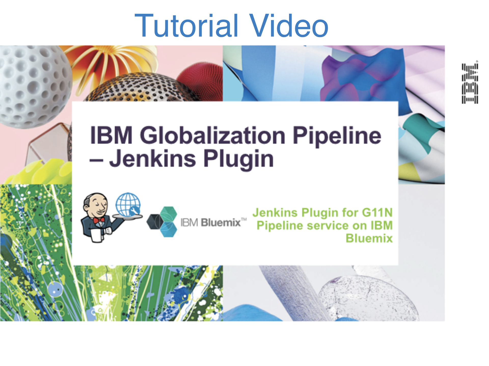
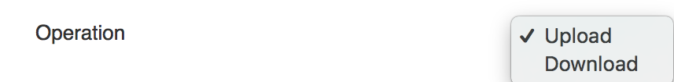
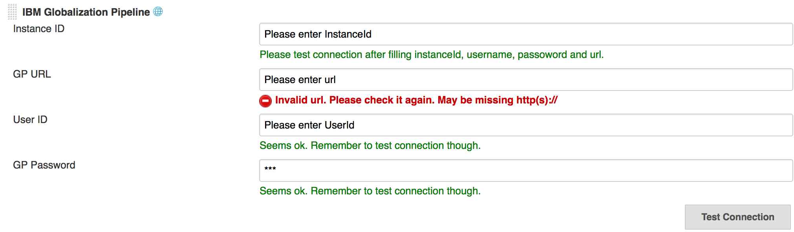
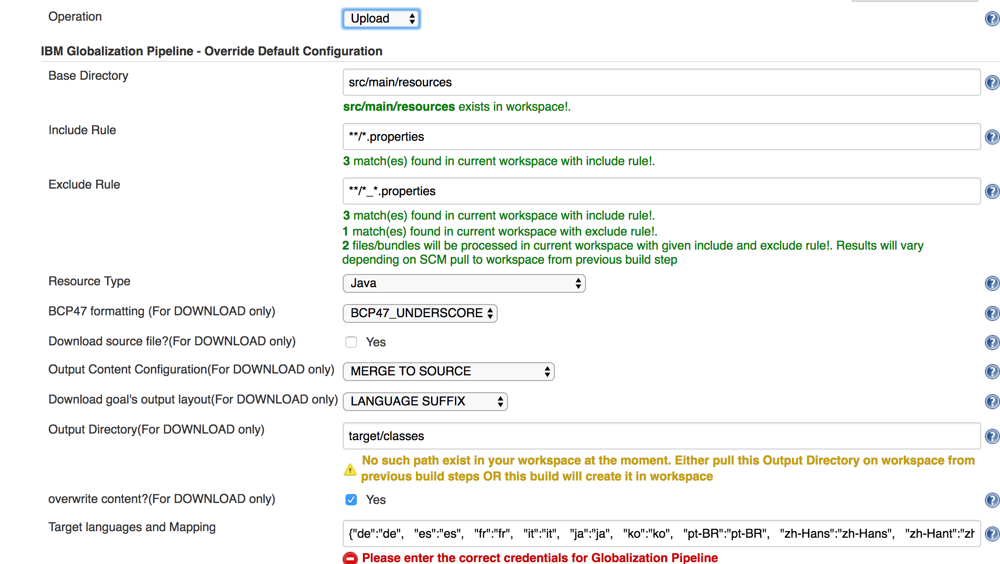
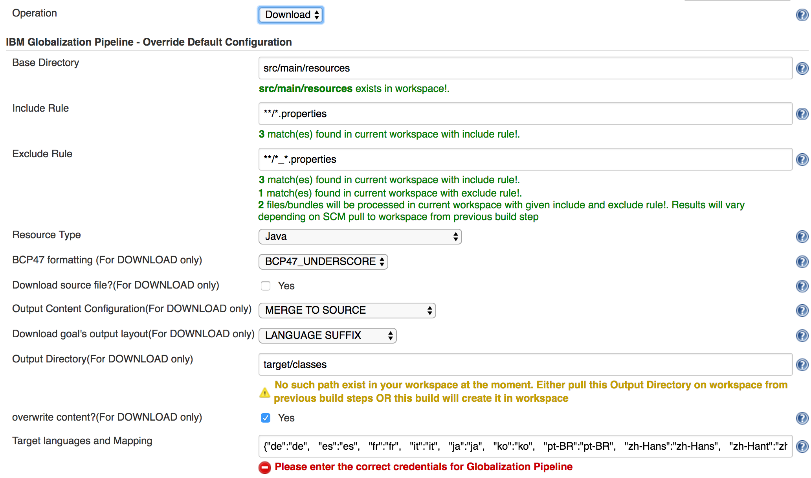
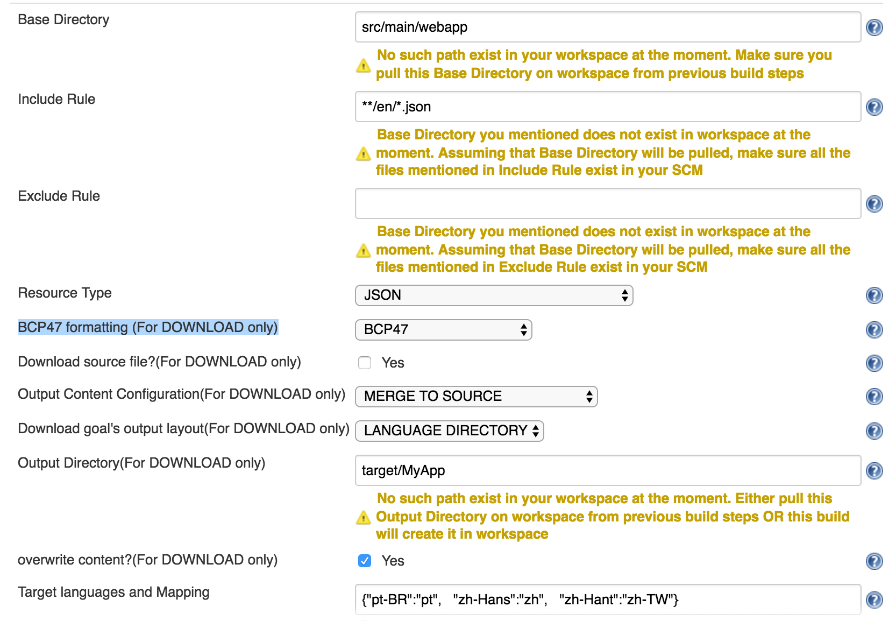
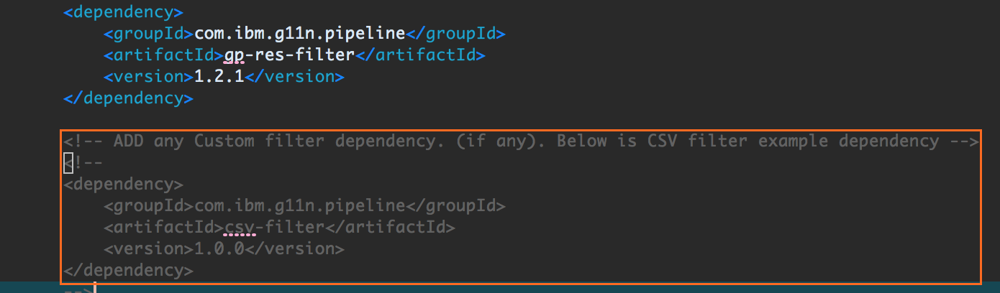
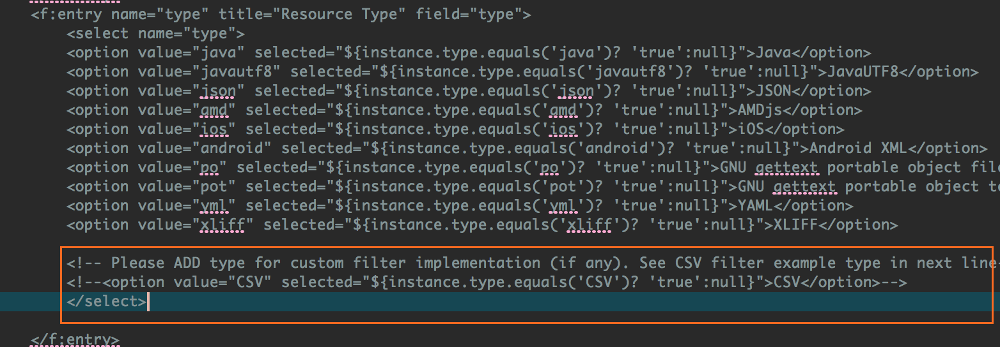
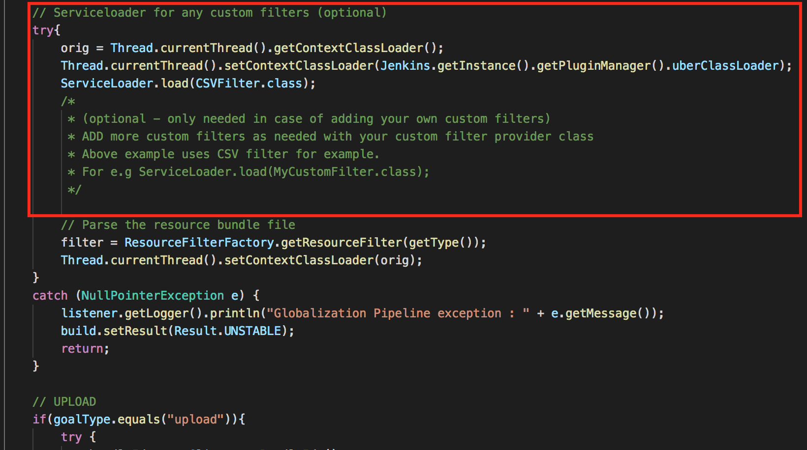

# Globalization Pipeline Jenkins Plugin User Guide
<!--
/*  
 * Copyright IBM Corp. 2017
 *
 * Licensed under the Apache License, Version 2.0 (the "License");
 * you may not use this file except in compliance with the License.
 * You may obtain a copy of the License at
 *
 * http://www.apache.org/licenses/LICENSE-2.0
 *
 * Unless required by applicable law or agreed to in writing, software
 * distributed under the License is distributed on an "AS IS" BASIS,
 * WITHOUT WARRANTIES OR CONDITIONS OF ANY KIND, either express or implied.
 * See the License for the specific language governing permissions and
 * limitations under the License.
 */
-->
* [Overview](#TOC-Overview)
* [Prerequisites](#TOC-Prerequisites)
* [Installation](#TOC-installation)
* [Operations](#TOC-Operations)
* [Usage](#TOC-Usage)
  * [Specifying Globalization Pipeline Service Credentials](#TOC-Usage-Credentials)
  * [Basic Use Case](#TOC-Usage-Basic)
  * [Advanced Use Cases](#TOC-Usage-Advanced)
* [Configuration Parameter Reference](#TOC-ConfigParamRef)
* [Custom Resource Filter](#TOC-CustomFilter)


---
## <a name="TOC-Overview"></a>Overview

Globalizaton Pipeline Jenkins Plugin is designed for integrating Globalization
Pipeline service with Jenkins jobs and builds. The plugin can upload translatable resource
bundles from any Jenkins job workspace to an instance of Globalization Pipeline service
and download translated resource bundles to Jenkins job workspace.

<center><a href="http://www.youtube.com/watch?feature=player_embedded&v=h49hljXjPjY" target=""></a></center>

---
## <a name="TOC-Prerequisites"></a>Prerequisites

* [Jenkins](https://jenkins.io/download/) with v1.625.3 or greater
* [IBM Globalization Pipeline](https://console.bluemix.net/catalog/services/globalization-pipeline) instance on any region of IBM Cloud.
* [Maven](https://maven.apache.org/download.cgi) v3.0 or greater

---
## <a name="TOC-installation"></a>Installation

Add following `settings.xml` file in `${user.home}/.m2` folder

```
<settings>
  <pluginGroups>
    <pluginGroup>org.jenkins-ci.tools</pluginGroup>
  </pluginGroups>

  <profiles>
    <!-- Give access to Jenkins plugins -->
    <profile>
      <id>jenkins</id>
      <activation>
        <activeByDefault>true</activeByDefault> <!-- change this to false, if you don't like to have it on per default -->
      </activation>
      <repositories>
        <repository>
          <id>repo.jenkins-ci.org</id>
          <url>https://repo.jenkins-ci.org/public/</url>
        </repository>
      </repositories>
      <pluginRepositories>
        <pluginRepository>
          <id>repo.jenkins-ci.org</id>
          <url>https://repo.jenkins-ci.org/public/</url>
        </pluginRepository>
      </pluginRepositories>
    </profile>
  </profiles>
  <mirrors>
    <mirror>
      <id>repo.jenkins-ci.org</id>
      <url>https://repo.jenkins-ci.org/public/</url>
      <mirrorOf>m.g.o-public</mirrorOf>
    </mirror>
  </mirrors>
</settings>
```
This file is shown in [Setting up Environment](https://wiki.jenkins.io/display/JENKINS/Plugin+tutorial#Plugintutorial-SettingUpEnvironment) section. Please double check the file content from there.

Now, clone [gp-jenkins](https://github.ibm.com/gp/gp-jenkins/) repository and run `mvn clean install` in this repository.
This will create `gp-jenkins.hpi` file in `target` folder.

Now, share this `gp-jenkins.hpi` to your Jenkins admin or if your are hosting Jenkins as an admin, please upload [gp-jenkins.hpi](https://jenkins.io/doc/book/managing/plugins/#advanced-installation) plugin.

If you want to run this plugin without uploading to your Jenkins space, you can test this plugin in a stand-alone Jenkins instance by running `mvn hpi:run` on cloned repository folder.

Once you have this plugin installed in your Jenkins space, you add a `Build Step` called `IBM Globalization Pipeline` in your existing or newly created Jenkins job.

---
## <a name="TOC-Operations"></a>Operations

In this Build Step, Operations available for this plugin are below.


| Operation | Description |
| ---- | ------------|
| upload | Upload translatable resource bundle files from Jenkins job workspace to an instance of Globalization Pipeline service. |
| download | Download translated resource bundles from an instance of Globalization Pipeline service to Jenkins job workspace. |

---
## <a name="TOC-Usage"></a>Usage

### <a name="TOC-Usage-Credentials"></a>Specifying Globalization Pipeline Service Credentials

The plugin requires *service instance administrator* credentials for a Globalization
Pipeline service instance. Please refer [Quick Start Guide](https://github.com/IBM-Cloud/gp-common#quick-start-guide)
to see how to get service credentials information of your Globalization Pipeline instance.

Fill those credentials in this Build Step and test connection.



### <a name="TOC-Usage-Basic"></a>Basic Use Case

By default, Globalization Pipeline plugin assumes all translatable English resource bundle
files are in Java property resource bundle format (*.properties) and they are placed under
the standard directory (src/main/resources) in your Jenkins job workspace. If your project follow this convention,
you don't need to override default configuration in Build Step.

#### Uploading Source Resource Bundles
```
Operation : upload
```


This goal does following tasks:

1. Scans files under `src/main/resources` for Jenkins job workspace and locates files with `.properties` extension
(but excluding files with '_'(underscore) character in its file name, such as
`Messages_fr.properties`).

2. For each Java property resource bundle file, checks if corresponding Globalization
Pipeline bundle already exists or not. If it's not available, creates a new bundle
with all translation target languages currently configured. English is used as the
translation source language.

3. Extracts resource strings from each file, and uploads them to the matching
Globalization Pipeline bundle as the translation source.

This operation will synchronize the contents of a Globalization Pipeline bundle with
the contents of files in Jenkins job workspace. When a resource key was deleted from those files, it will
be also deleted from the corresponding Globalization Pipeline bundle. If a resource
string value was changed, this operation refreshes the corresponding resource string's
value, which eventually triggers re-translation. When the contents is not changed
since last invocation, this operation does not make any changes in the Globalization
Pipeline bundles.

So the best practice would be invoking this goal when any changes were made in
translatable resource bundle files, although it's not harmful to invoke the goal
at any time.

#### Downloading Translated Resource Bundles
```
Operation : Download
```


This goal does following tasks:

1. Scans files under `src/main/resources` in Jenkins job workspace and locates Java property resource bundle
files. This is same as in the upload operation.

2. For each Java property resource bundle file, check if look up corresponding
Globalization Pipeline bundle in the instance of Globalization Pipeline service.

3. If matching Globalization Pipeline bundle is found, copies the contents of
source bundle file in Jenkins job workspace, extracts resource strings from the Globalization
Pipeline bundle, then replaces resource string values with ones extracted
from the Globalization Pipeline bundle. The result file is generated under the
standard build output directory (`target/classes`) in Jenkins job workspace with language suffix, such
as `Messages_fr.properties` for French. This operation is done for all available
target languages in the Globalization Pipeline bundle.

In many cases, you will likely want to execute the goal during `package` phase
and include translated resource bundles downloaded from an instance of Globalization
Pipeline service.

## <a name="TOC-Usage-Advanced"></a>Advanced Use Cases

Globalization Pipeline Jenkins Plugin supports various configuration parameters to customize
the behavior. This section provides some use cases with these configuration parameters.
Please see [Configuration Parameter Reference](#TOC-ConfigParamRef) for further information
about the configuration parameters.


### Custom Language ID Mapping

Globalization Pipeline service uses language ID "pt-BR" for Brazilian Portuguese, "zh-Hans" for
Simplified Chinese and "zh-Hant" for Traditional Chinese. You may want to use just "pt"
for Brazilian Portuguese, or "zh" for Simplified Chinese, "zh_TW" for Traditional Chinese
as a part of output file name (or path). The following example does such mapping.


If you have properties file `src/main/resources/com/ibm/example/MyStrings.properties`,
`download` goal will generate Brazilian Portuguese translated file `target/classes/com/ibm/example/MyStrings_pt.properties`
instead of `target/classes/com/ibm/example/MyStrings_pt_BR.properties`

Note: The language ID separator used in the mapping should be '-' (Hyphen) for both,
even you want translated file name (or path) to use '_' for the language part. In the example
above, do not specify `"zh-Hant" : "zh_TW"` even you want `MyStrings_zh_TW.properties`
as the output file name. The language ID style is configured by `BCP47 formatting (For DOWNLOAD only)` field.


### Translated JSON Files in Language Directories

Your project may need place localized JSON files in its own language directory.
Following example supports all JSON files in directory "en" and produces translated
versions in parallel language directories.



`Download goal's output layout(For DOWNLOAD only)` field specifies file name/path mapping behavior. **LANGUAGE_DIRECTORY** specifies
localized version will use the same file name with source, but placed in a directory
for the language. `BCP47 formatting (For DOWNLOAD only)` field specifies the style of language ID used for
file/path name. **BCP47** specifies the BCP 47 language tag. In this case, '-' (Hyphen)
is used for subtag separators, such as 'zh-Hans'.

With this example, if you have English JSON resource file at `src/main/webapp/res/en/MyStrings.json`,
French version is generated at `target/MyApp/res/fr/MyStrings.json`, and Simplified Chinese
version is generated at `target/MyApp/res/zh-Hans/MyStrings.json`.


# <a name="TOC-ConfigParamRef"></a>Configuration Parameter Reference

### `Credentials`

Specifies Globalization Pipeline service credentials. There are 4 fields
below.

* `GP URL` REST service URL, for example, `https://gp-rest.ng.bluemix.net/translate/rest`
* `User ID` User ID
* `GP Password` Password
* `Instance ID` Service instance ID

See [Specifying Globalization Pipeline Service Credentials](#TOC-Usage-Credentials) for
further information.

### `Source Language`

Specifies BCP 47 language tag for the language used in the source bundles. The default value is "en" (English).

### `Output Directory(For DOWNLOAD only)`

Specifies the output base directory used by `download` operation.

The default value is the standard Java class file output directory (`target/classes`).


### `overwrite content?(For DOWNLOAD only)`

Specifies a boolean value to control whether `download` operation overwrites translated resource bundle files
already in the output directory or not.
The default value "true" (checked)


### `Base Directory, Include Rule and Exclude Rule`

Specifies a set of source bundle files.

* `Base Directory` (required) Base directory
* `Include Rule` Sets for inclusion rules specified by Ant-Style pattern
* `Exclude Rule` Sets for exclusion rules specified by Ant-Style pattern

The inclusion/exclusion rules use the standard ant/maven fileset syntax. For example,


Above example includes all the json files under `src/MyResources` directory, but
excludes all files with file name `config.json`.

### `Resource Type`

Specifies a resource type. Available options are

* **JAVA** - Java property resource bundle file
* **JAVAUTF8** - Java UTF8 property resource bundle file
* **JSON** - Resource string key/value pairs stored in JSON format. For now nested JSON object is not supported.
* **AMDJS** - RequireJS I18N bundle file
* **GLOBALIZEJS** - Globalize.js JSON resource bundle file
* **IOS** - iOS String Resource file
* **ANDROID** - Android String Resource file
* **PO** - GNU Gettext portable object file
* **POT** - GNU Gettext portable object template file
* **YML** - YAML resource bundle file
* **XLIFF** - XLIFF 1.2 file

The default value is **JAVA**.


### `Target languages and Mapping`

This requires a json input.

`upload` operation is only concerned with key of this json input. Keys specify a list of translation target languages by BCP 47 language tags
For example,
```
    {"fr" : "Not concerned with upload", "zh-Hans" : "Anything for upload"}
```
with `upload` operation creates a new Globalization Pipeline bundle with French and Simplified Chinese translation languages.

`download` operation takes both keys and mapped values of this json input into consideration.
This specifies custom language mappings. Each key is a [BCP 47 language tag](https://tools.ietf.org/html/bcp47)
used by Globalization Pipeline service instance, and the element value is a language ID used for
output resource file or path name. For example, Globalization Pipeline service uses language ID
"pt-BR" for Brazilian Portuguese. If you want to use just "pt" for output file or path name, you
can specify the mapping as below.

```
    {"pt-BR" : "pt"}
```

By default, All BCP47 language tags i.e target languages served by Globalization Pipeline are kept as key and same is kept for values.


### `BCP47 formatting (For DOWNLOAD only)`

Specifies one of following options to configure the rule for composing language ID used
for output resource bundle file or path name.

* **BCP47_UNDERSCORE** BCP 47 language tag, replacing '-' with '_'. For example, *zh_Hant* for Traditional Chinese.
* **BCP47** BCP 47 language tag itself. For example, *zh-Hant* for Traditional Chinese

The default value is **BCP47_UNDERSCORE**.

### `Output Directory(For DOWNLOAD only)`

Specifies the output base directory for the sets of bundles chosen by above options.

### `Download source file?(For DOWNLOAD only)`

Specifies a boolean value to control whether `download` goal also produces resource bundle
files for a source language.
The default value is "false". (Unchecked)

### `Output Content Configuration(For DOWNLOAD only)`

Specifies one of following options to control how `download` goal generates the contents of
translated resource bundle files.

* **MERGE_TO_SOURCE** Duplicates the contents of the source bundle and replaces only translated
resource strings. This option might not be implemented by some format types. In this case,
**TRANSLATED_WITH_FALLBACK** is used instead.
* **TRANSLATED_WITH_FALLBACK** Emits only resource strings (with a simple header if applicable).
When translated string value is not available, the value in the source language is used.
* **TRANSLATED_ONLY** Emits only resource strings (with a simple header if applicable).
When translated string value is not available, do not include the key in the output.
* **MERGE_REVIEWED_TO_SOURCE** Duplicate the contents of the source bundle and replaces only
translated resource strings marked as reviewed. This option might not be implemented by some
format types. In this case, **REVIEWED_WITH_FALLBACK** is used instead.
* **REVIEWED_WITH_FALLBACK** Emits only resource strings marked as reviewed. When translated string
value is not available, or not marked as reviewed, the value in the source language is used.
* **REVIEWED_ONLY** Emits only resource strings marked as reviewed. When translated string value
is not available, or translated not marked as reviewed, do not include the key in the output.

The default value is **MERGE_TO_SOURCE**.

### `Download goal's output layout(For DOWNLOAD only)`

Specifies one of following keywords to control output file name or path in `download` goal.

* **LANGUAGE_SUFFIX** In the same directory with the source bundle file, with extra language suffix.
For example, if the source bundle file is `com/ibm/g11n/MyMessages.properties`, then the French
version will be `com/ibm/g11n/MyMessages_fr.properties`.
* **LANGUAGE_ONLY** In the same directory with the source bundle file, using language code as the file name with the original file extension. For example, if the source bundle file is `res/en.json`, then the French version will be `res/fr.json`.
* **LANGUAGE_SUBDIR** In a language sub-directory under the directory where the source bundle file
is placed. For example, if the source bundle file is `res/MyMessages.json`, then the French
version will be `res/fr/MyMessages.json`.
* **LANGUAGE_DIR** In a language directory at the same level with the source bundle file.
For example, if the source bundle file is `com/ibm/g11n/en/MyMessages.properties`,
then the French version will be `com/ibm/g11n/fr/MyMessages.properties`.

The default value is **LANGUAGE_SUFFIX**.


# <a name="TOC-CustomFilter"></a>Custom Resource Filter

[Globalization Pipeline Resource Filter](https://github.com/IBM-Cloud/gp-java-tools/tree/master/gp-res-filter) provides
a mechanism to implement your own custom filter, that can be used through
Globalization Pipeline Maven Plugin/Ant Task and other tools (including this Jenkins Plugin).

To embed your own custom filter with this Jenkins plugin, follow these steps

1. Add your custom resource filter dependency in [pom.xml](https://github.com/IBM-Cloud/gp-jenkins/blob/master/pom.xml)


The image above uses the example of [csv-filter](https://github.com/IBM-Cloud/gp-java-tools/tree/master/examples/custom-res-filter/csv-filter). Please use it for reference to create your own custom filter.

2. Add your filter type in [config.jelly](https://github.com/IBM-Cloud/gp-jenkins/blob/master/src/main/resources/org/jenkinsci/plugins/gpjenkins/GlobalizationPipelineBuilder/config.jelly)

Again, the image above uses the type `CSV` from example of [csv-filter](https://github.com/IBM-Cloud/gp-java-tools/tree/master/examples/custom-res-filter/csv-filter). Please use it for reference to create your own custom filter.

3. Allow Jenkins to load your provider class in [GlobalizationPipelineBuilder.java](https://github.com/IBM-Cloud/gp-jenkins/blob/master/src/main/java/org/jenkinsci/plugins/gpjenkins/GlobalizationPipelineBuilder.java)
This is done during the `upload` part of implementation

Again, the image above uses the example of [csv-filter](https://github.com/IBM-Cloud/gp-java-tools/tree/master/examples/custom-res-filter/csv-filter). Please use it for reference to create your own custom filter.
